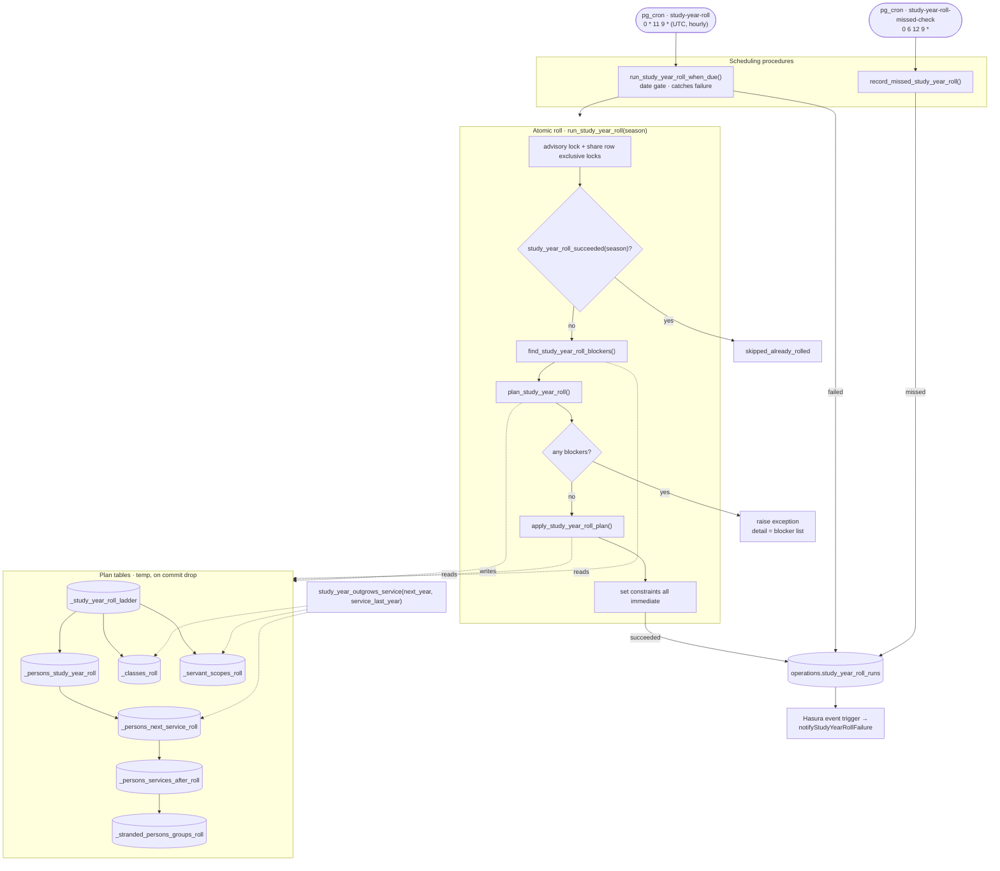

# Annual study-year roll (ENG-202)

Advances every graded person one study year on 11 September (Nayrouz), and
moves the service memberships, group memberships, classes and servant scopes
that depend on their grade. Everything lives in the `operations` schema.

## Pipeline

The one domain rule shared by memberships, classes and scopes is
`study_year_outgrows_service`: a cohort whose next study year is past a
bounded service's last year (or that has no next year at all) leaves that
service. Everything else is bookkeeping around it.

## Scheduling

`pg_cron` 1.6 ships in the Postgres image but is not preloaded. Enabling it is a
one-time operator action:

1. Add `pg_cron` to `shared_preload_libraries` alongside `timescaledb`, and set
   `cron.database_name = 'church_admin'`.
2. Restart the database.
3. Apply the migration, which runs `create extension if not exists pg_cron` and
   registers the job.

The job is registered as `0 * 11 9 *` — hourly for the whole of 11 September,
**UTC**. pg_cron evaluates cron expressions in the server timezone, so a literal
`0 0 11 9 *` would not mean midnight in Cairo, and would drift whenever Egypt
changes its DST rules. Instead the schedule is deliberately loose and
`run_study_year_roll_when_due` decides whether to act, comparing
`cairo_now()::date` against `nayrouz_date(season)`:

- Not 11 September Cairo: does nothing.
- 11 September Cairo: runs, unless this season already succeeded.
- 12 September 06:00 UTC: `record_missed_study_year_roll` writes `missed`
  if no success was recorded, per [C14].

Hourly firing gives free retries within the day when the midnight attempt fails,
which is the retry policy [E19] left open. It never produces an unattended
catch-up on a later date.

Both procedures take an optional `p_today date` that defaults to the Cairo
date. It exists so the tests can drive the date gate and the failure path; the
cron jobs call them without it.

## Transaction and failure recording

The roll must be atomic, but a rolled-back transaction cannot leave a record of
its own failure. The two are separated:

- `run_study_year_roll(season)` is the atomic unit. All DML lives here. It ends
  with `set constraints all immediate` so that the deferred constraint triggers
  (`persons_container_check`, `check_persons_service_rel`) fire inside the
  function instead of at the outer commit, and a violation surfaces as an
  exception from the call. This is also why a `begin; …; rollback;` dry run
  proves nothing on its own ([E22]) — force constraints first.
- `run_study_year_roll_when_due()` calls it inside a `begin … exception`
  block. On failure the block's subtransaction rolls the roll back, and the
  procedure records `failed` with the exception message and detail (the
  blocker list lives in `detail`). That insert commits with the procedure.

Idempotency is a partial unique index on `season_year where status = 'succeeded'`.
A failed attempt therefore does not block a retry the same day, and a successful
one can never be repeated ([C13], [C16]).

A second partial unique index on `season_year where status = 'failed'` keeps the
hourly retries to one `failed` row per season: the recording insert is an
`on conflict … do update`, which replaces the error with the latest attempt's.
Retries stay free, but a season that fails all day alerts once rather than
twenty-one times.

Every insert into `operations.study_year_roll_runs` fires a Hasura event
trigger; the Cloud Function pushes a maintenance notification for `failed` and
`missed` rows to users holding the `maintenanceNotifications` permission. An
`on conflict … do update` is an update, so it does not fire that insert-only
trigger — which is what bounds the alert to one per season.

## Concurrency

The roll takes `pg_advisory_xact_lock` so two rolls cannot interleave, and locks
`study_years`, `services`, `persons`, `persons_services`, `persons_groups`,
`classes` and `auth.users_admin_on` in `share row exclusive` mode for its
duration. Reads are unaffected; concurrent writers wait for the few seconds the
roll takes. This closes [E18], which the advisory lock alone did not.

## Pre-flight validation

`find_study_year_roll_blockers()` builds the plan tables and returns one row
per blocking problem. The roll calls it first and aborts before mutating
anything. It is also meant to be run manually in early September, so that a
misconfiguration surfaces days ahead instead of aborting the unattended run at
midnight with no catch-up available.

It blocks on:

- a `next_service_id` cycle or self-link ([E7])
- a person whose only remaining connection would be removed ([C8])
- a class whose destination placement would not match its cohort's next grade ([C9], [E8])
- a `next_service_id` pointing at a soft-deleted service, when a membership or
  class would actually move there ([E14])
- a person whose next grade falls outside the destination service's study year
  range, which the deferred `check_persons_service_rel` would otherwise raise
  from inside `set constraints all immediate`, long after the pre-flight passed

The first, third and fourth are invariants on `services` that could be enforced
by a trigger at write time instead; that is a schema change outside this
ticket, and the pre-flight would stay regardless because its job is a readable
report days ahead, not enforcement.

## Decisions taken on items the ticket left open

**Servant scope wrap ([E11]).** When the wrap target would be `null` — the
service has no lower bound, so `null` means all-year access — the scope is left
unchanged and counted as skipped. The roll never widens a servant's access.

**Converging memberships.** `persons_services` is unique on
`(person_id, service_id)`. When two of a person's memberships route to the same
next service, or the person already holds the destination, all but one row are
deleted (`dedupe`) before the survivor moves. Without that step the move would
raise a unique violation and abort the whole roll.

**Group memberships (§2b).** `persons_groups_check` only runs when the group
membership itself is written, so dropping or moving a service membership can
strand a group membership whose service the person has left. After the service
step, group memberships whose group belongs to a service the person is leaving,
and which no other membership brings them back into, are deleted and counted.
Group memberships are not auto-moved to the destination service: there is no
reliable mapping between a source group and a destination one.

**Soft-deleted classes ([E14]).** Skipped. A deleted class has no live roster to
carry forward and advancing a tombstone only corrupts it. Soft-deleted _people_
still advance, per [C3].

**Classes stay cohorts ([C9], [C10]).** A class is a (service, grade) cohort.
Each roll the cohort's grade goes up: `advance` bumps `service_study_year`
within the same service; `relocate` moves the class to `next_service_id` at
that service's first grade when the cohort outgrows the service; `delete` sets
`deleted_at` when the next service is ungraded, because an all-ages service has
no grade slot for the cohort to land in. A cohort that outgrows a service with
no next service, or that has no next grade, is left alone. The alternative — classes as fixed slots that never move, with
membership resolved live from service, grade and gender — would delete [C9],
[C10], [E8], [E13] and [E15] outright. It was raised and not adopted; revisit
before adding more class-move complexity.

## Recovery

Counts alone cannot reconstruct changed rows ([E23]). `down.sql` removes the
functions and the schedule; it does not and cannot undo a roll. Re-running the
roll is never an undo. Recovery from a bad-but-committed roll is a restore from
the point-in-time backup taken before the scheduled window.

## Manual and late runs

A late or repeat run is deliberately awkward. `run_study_year_roll(season)`
can be called directly by an operator, but only after confirming no manual
advancement happened in the meantime, because nothing detects double
advancement ([E2]).
